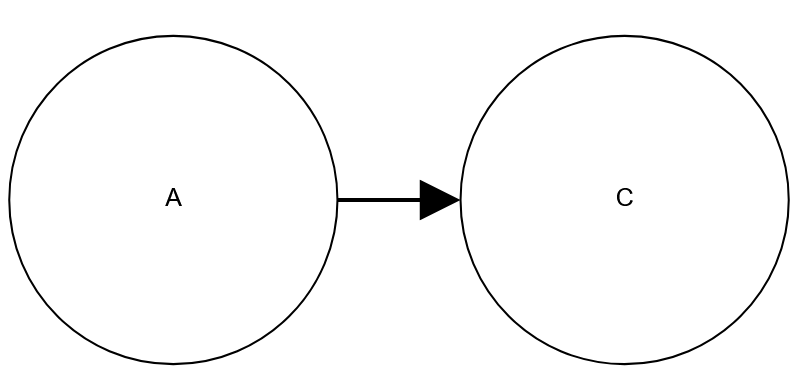
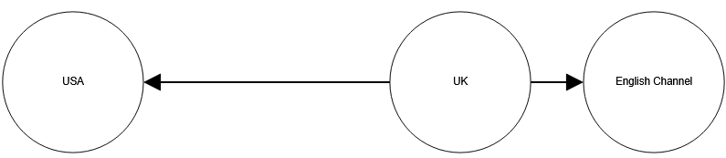
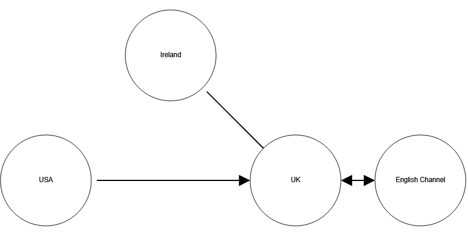
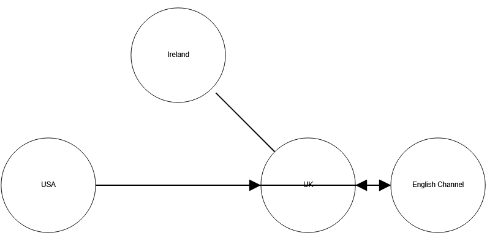
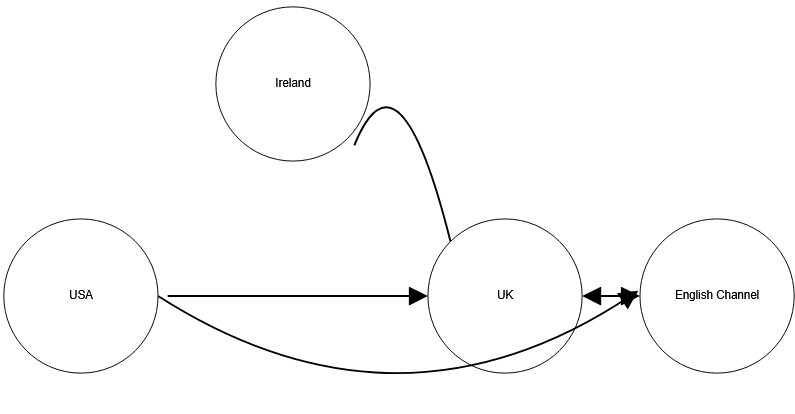

# SPIFF - Simple Protoype Implementation For Flowcharts

A vibe-coded garbage throaway code toy tool I wrote to scratch the itch of wanting to create manual layout SVG diagrams as code.

Because nobody, not even Pichkr, would give me that.

This does what I want and I'm sharing it for other game masters to use for preparing node graphs and relationship graphs with simple manual layouts.

## How to use?

### Basics

You add nodes and edges to a diagram using the following format into the textbox.

```spiff
A -> E -> B
```


Where `A` is a string representing a node, `E` is a compass cardinal direction (N, S, E, W, NE, NW, SE, SW), and `B` is a string representing a different node.

Then you click the Render Graph button or press Ctrl + Enter to render the diagram.

Each line is parsed at once, you can have multiple lines in the graph at the same time.

The diagram is base64-encoded so you can bookmark some pages, and there is a handy Download SVG button to save it locally for later use.

Last of all, the viewport can be clicked and dragged around in javascript.


### Line length controls

You can increase the spacing of the nodes on a per-line basis by adding additional hyphens in front of the first arrow.

```spiff
UK -> E -> English Channel
UK --> W -> USA
```



### Line attributes

You can modify the lines between the nodes by adding one or more attributes inside square brackets.

By default, arrows have one point at the end of the line, but you can mess with it by including arrow directions. Turning off the arrow at the end of the line (via `arrow=start` or `arrow=none`) currently leaves a gap, I should bugfix that someday but for my usecase I don't care so um. Yeah.

```spiff
UK -> E -> English Channel [arrow=both]
UK --> W -> USA [arrow=start]
UK -> NW -> Ireland [arrow=none]
```



### Line curvature

If one line crosses a node and obscures its node text, you can add a `curve=up` or `curve=down` attribute to its line to help it get out of the way somewhat.

#### Before

```spiff
UK -> E -> English Channel [arrow=both]
UK --> W -> USA [arrow=start]
UK -> NW -> Ireland [arrow=none]
USA -> E -> English Channel
```



#### After

```spiff
UK -> E -> English Channel [arrow=both]
UK --> W -> USA [arrow=start]
UK -> NW -> Ireland [arrow=none curve=up]
USA -> E -> English Channel [curve=down]
```



Note that in the above example, the combination of attributes can be accomplished by space-separating the arguments within the same square brackets, see the Ireland line.

## Tech Minutae

Not that it matters to most, but the source text for the graph is embedded into the svg file for who knows what use down the road.

Browser compatibility wise, this does not support IE anything but it was tested on Firefox on Windows so there you go. Chrome and Webkit peeps should probably still be happy?

## Roadmap?

This already covers 80% of what I wanted, but I could see myself eventually having the itch to add the following features on my own time.

1. being able to label the arrows
1. being able to customize the start and endpoints on each shape for the arrow. So you could go something like 'the southeast corner of node A running northwest towards the north corner of node B', sounds complicated, probably not worth it.
1. Colors?
1. CSS?? now we are getting fancy
1. A legend thing where the nodes and the arrows are printed with just an identifier string and off to the side the string key and value are there for reading this diagram
1. drag-drop window can be auto-sized to be a landscape letter or other defined page size
1. multi-line text labels?
1. fix that bug where lines end before they touch the node
1. for curved lines, fix the arrowhead not being straight on to the line it is intersecting
1. PNG export?
1. overall diagram label titles
1. support a syntactic sugar like `A <-> N -> B` or `A <-N-> B` instead of needing to do `A -> N -> B [arrow=both]`
1. Any error messages / syntax checking feedback at all besides just wonky or dead graphs with console warnings
1. being able to have non-circle shapes

## Local development

Developed using vscode over remote ssh to a debian 12 VM.

### Local rendering tesing Use VSCode Remote Port Forwarding (Built-in)**

1. In VSCode, open the Command Palette (`Ctrl+Shift+P`).
2. Run: `Forward a Port`
3. Enter a local port (e.g., `5500`)
4. VSCode will give you a URL like `http://127.0.0.1:5500`
5. On the remote terminal (in VSCode), start a static file server in your project folder:
```bash
python3 -m http.server 5500
```
6. In your local browser, go to `http://127.0.0.1:5500/index.html`